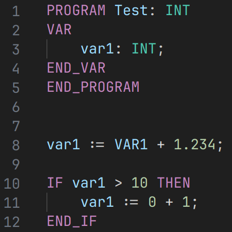
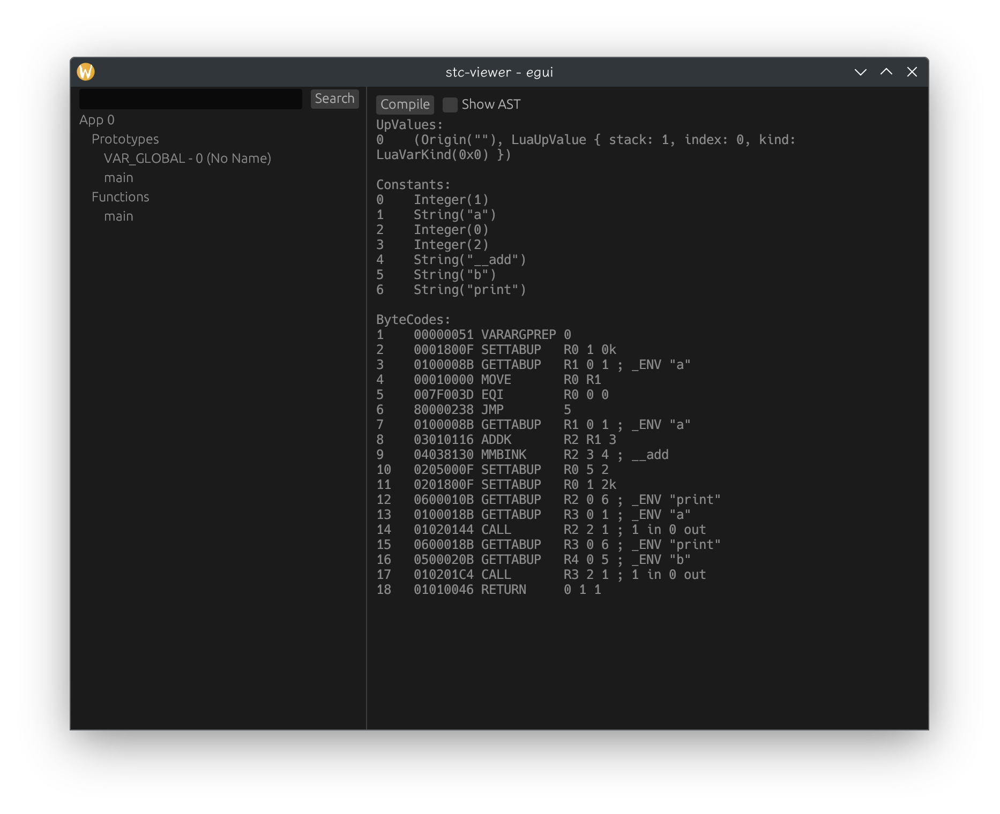

English | [简体中文](./README.zh-CN.md)
> This project is IEC-61131-3 Compiler implementation for technologies research.

## Features
1. IEC-61131-3 Structured Text language support
2. Pure safe Rust
3. LALRPOP generated parser & hand write LL(\*) parser
4. Lua byte code generate backend
5. LSP support for IDE
6. A compiler internal data viewer UI tools

 
LSP-based syntax highlighting

 
A compiler data viewer tools UI

### TODO-List
- [ ] LSP implementation
- [ ] TreeView right-click popup menu
