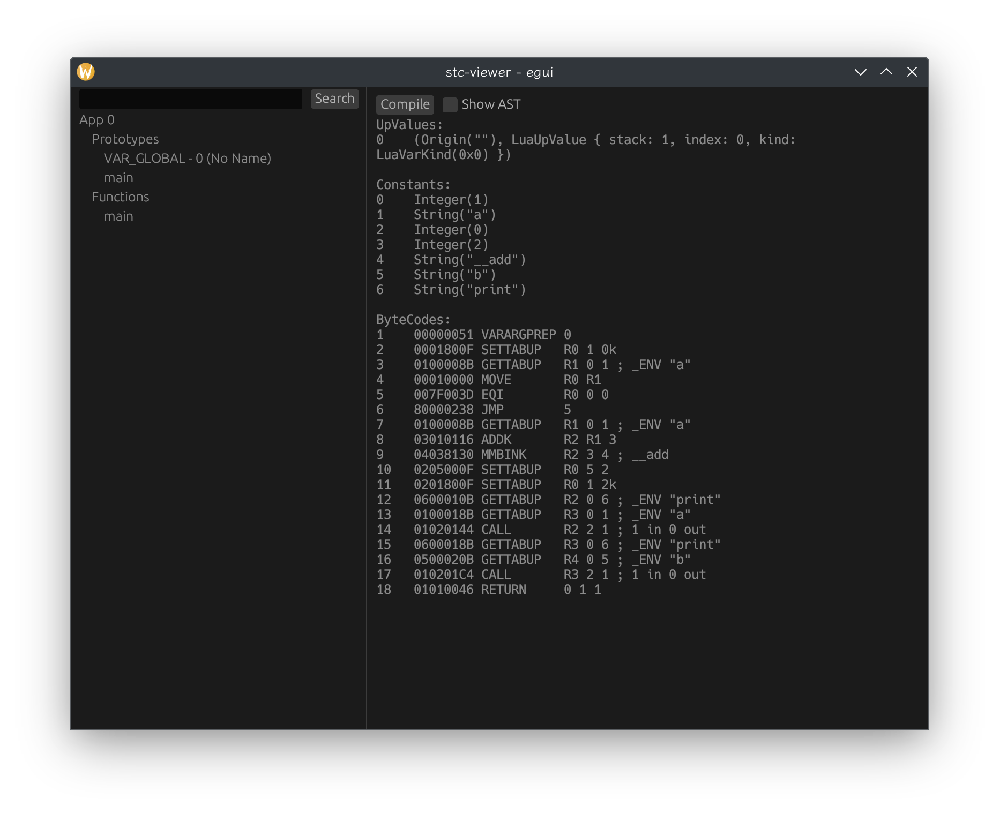

[English](./README.md) | 简体中文
> 此项目是 `IEC-61131-3` 标准的编译器实施，用于技术研究目的。

## 特性列表
1. IEC-61131-3 结构化文本（ST）编程语言实现
2. 100% 纯安全 Rust 语言实现
3. 具有基于 LALRPOP 的生成式解析器 & 基于手写的 LL(\*) 解析器
4. LUA ByteCode 的目标代码生成后端
5. 支持通过 LSP 协议为 IDE 提供服务
6. 包含一个编译器内部数据可视化展示的 UI 界面

 
基于 LSP 协议的词法高亮

 
编译器内部数据可视化 UI 界面

### 待做列表
- [ ] 更完整的 LSP 实现
- [ ] 更易用的编译器内部数据可视化界面
